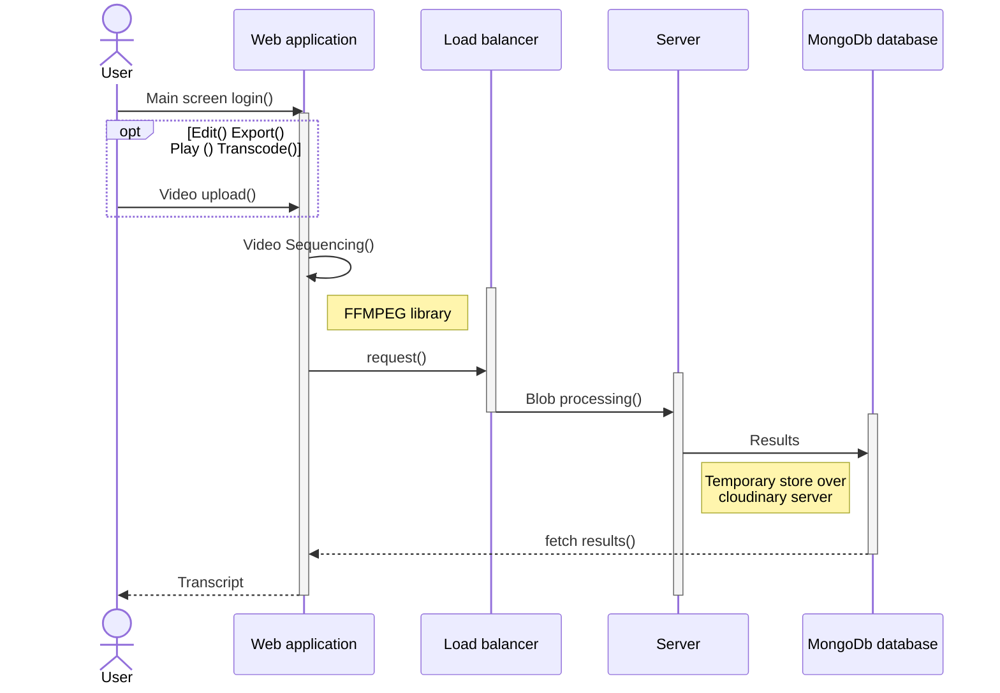

# SDM

```mermaid
sequenceDiagram
    actor User 
    
    User ->> Web application : Main screen login()
    activate Web application
    opt Edit()  Export() <br/> Play () Transcode()
        User ->> Web application : Video upload()
    end
    
    Web application ->> Web application : Video Sequencing() 
    activate Load balancer
    Note right of Web application : FFMPEG library
    
    Web application ->> Load balancer :  request()
    activate Server
    Load balancer ->> Server : Blob processing() 
    activate MongoDb database
    deactivate Load balancer
    
    Server ->> MongoDb database : Results 
    
    Note right of Server : Temporary store over <br/>cloudinary server
    MongoDb database -->> Web application : fetch results()
    deactivate MongoDb database
    Web application -->> User : Transcript
    deactivate Server
    deactivate Web application

```
